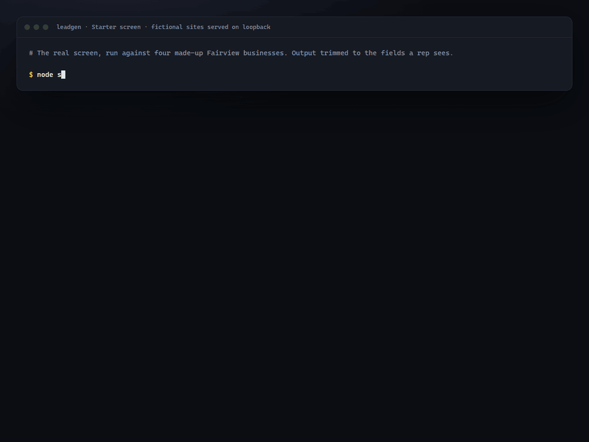
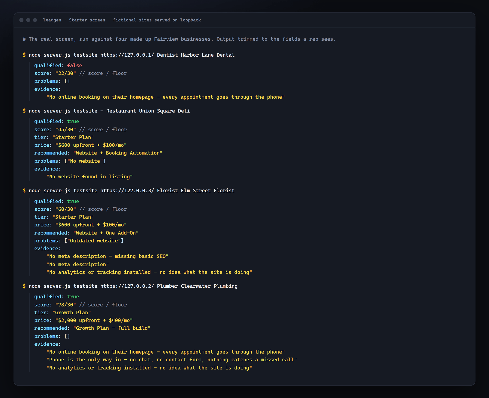
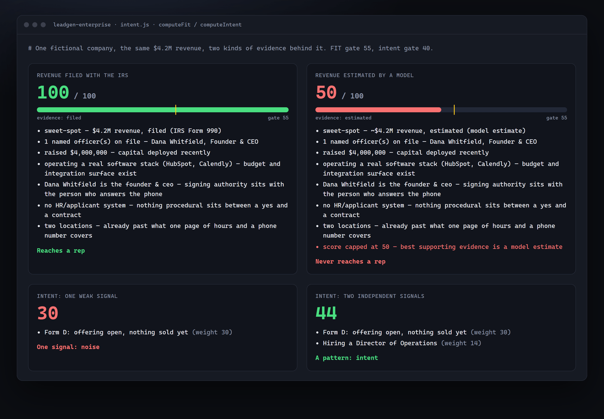
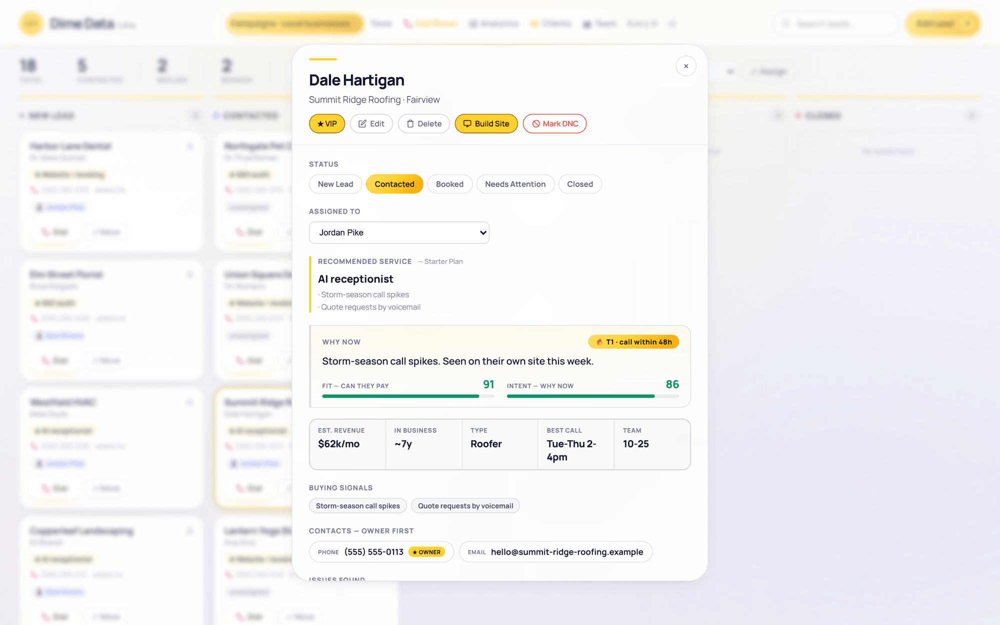
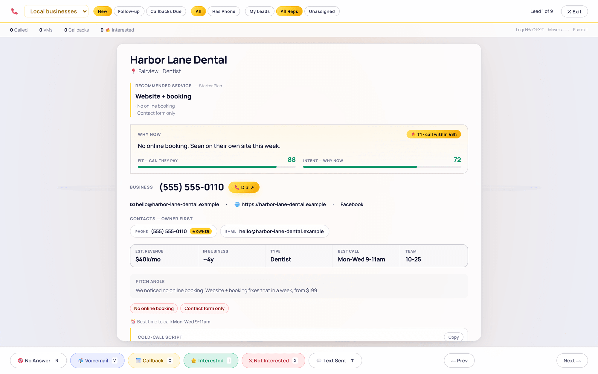

<p align="center"></p>

# Dime Data lead engines

**Lead generation that has to show its work.** Two engines find businesses for Dime Data's sales
team and hand each one to the CRM with a reason a rep can check. The local engine reads a business's
own website and recommends the one thing to sell it, with the evidence. The enterprise engine
finds mid-sized companies at a budget event in public filings, and refuses to rank any company
it could only size by guessing.

**Local engine in production** since June 2026 · enterprise engine built and tested, on hold ·
source is private.



<sub>Every result here is the real engine's output on fictional input: four made-up businesses
whose websites were served locally, and one made-up company for the enterprise scorer. The
terminal pages render that output, trimmed to the fields a rep sees. No customer data.</sub>

## The problem

Bought lead lists are the same rows every competitor bought, and AI-built lists are worse: a
confident revenue figure nobody can trace, a "pain point" the business doesn't have. A rep who
calls on that finds out on the first sentence. A lead is only worth calling if the reason to call
is something we actually observed, and the list should be short enough to work.

## What it does

| | |
|---|---|
| **Reads the page the customer sees** | The local engine fetches each business's homepage as a browser would, follows one scripted redirect, and spots parked domains. If it can't read the page, it recommends nothing rather than inventing a gap. |
| **One recommendation, with evidence** | Each observed gap (no booking, no after-hours answer, no analytics, no schema, no site at all) carries a weight. Below a floor of 30 the business is dropped. Above it, the engine counts independent gap areas: one is a Starter deliverable, several wired together is a Growth build. |
| **No contact, no lead** | A business with neither a phone number nor an email is never inserted. A lead with no phone goes to an admin list instead of a rep's dial queue. |
| **Filings, not a database** | The enterprise engine finds companies at a budget event: an SEC Form D raise, revenue growth on an IRS 990, a federal award, a wave of hiring on their own job board. All the sources are public and keyless. |
| **Evidence caps the score** | Every size claim carries its provenance, and FIT can't exceed what backs it: filed 100, verified 88, derived 72, estimated 50, none 35. The gate is 55, so a company sized only by a model's estimate never reaches a rep. |
| **Intent is a pattern, not a hit** | One weak signal is noise. Intent needs a single high-weight event or two independent signals in the window, and "high weight" is derived from the gate, so the two can't drift apart. |
| **Suppression before every insert** | Phone numbers are compared by digits across every number on a candidate, and suppression is only ever used to suppress: it never becomes a score or a field a rep can rank by. |

<p>


</p>
<p>


</p>

## How it works

```mermaid
flowchart LR
    subgraph Local engine
      O[OpenStreetMap<br/>Overpass] --> P[Read the homepage<br/>browser UA · redirect hop · parked check]
      P --> R[recommend<br/>weights · floor 30 · gap areas → tier]
    end
    subgraph Enterprise engine · on hold
      F[SEC Form D · IRS 990<br/>USAspending · ATS boards] --> X[Firmographics<br/>every fact tagged filed / verified /<br/>derived / estimated / none]
      X --> S[FIT capped by evidence<br/>intent needs a pattern]
    end
    R --> C[Contact gate +<br/>suppression scrub]
    S --> C
    C --> CRM[(CRM<br/>lead + recommendation + why now)]
```

**A recommendation is a claim, so it needs evidence.** Every gap the local engine scores is
something it read on the business's own page, and the evidence rides on the lead into the CRM. A
rep opens the card knowing what to pitch and why. A page the
engine couldn't read scores nothing, so a site that blocks crawlers isn't mistaken for a site with
problems.

**The cap is the guarantee.** The enterprise thesis is that a revenue figure lifted from a filing
and one a model produced on request are different facts, so they can't score the same. The cap
puts that into code, and the test suite asserts it, so tuning a weight can't quietly undo it.

## Built with

JavaScript on Node · OpenStreetMap Overpass · SEC EDGAR, ProPublica's IRS 990 API, USAspending
and public ATS job boards · Gemini through an agent gateway · Docker · a Postgres-backed CRM.

## By the numbers

| | |
|---|---|
| Enterprise tests | **231** passing, offline, with no network or keys (measured 2026-10-07) |
| Local screen self-test | **48** checks passing, both sides of every boundary pinned |
| Evidence caps | **5** tiers, **2** of them below the FIT gate by design |
| Commits | **32** to the two engines, 2026-06-11 to 2026-09-10 |

## Read the code

[`excerpts/`](excerpts) has three files from the private source: the evidence-tiered scoring, the
local engine's recommendation, and the phone suppression index.

## Status

The local engine is live and feeds Dime Data's CRM. The enterprise engine is built and tested but
on hold: its live run is switched off in both the CRM and the engine itself. The source is
private; this repository is a showcase. © 2026 Dime Data, all rights reserved (see
[LICENSE](LICENSE)). Built by [Dime Data](https://dimedata.cloud).
